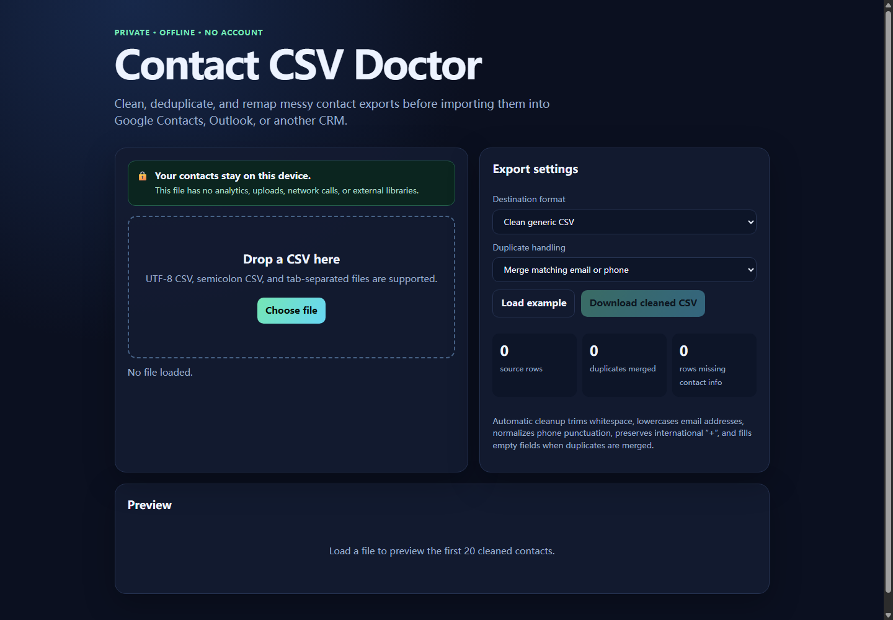

# Contact CSV Doctor

A private, offline contact CSV cleaner for migrations to Google Contacts, Outlook, and CRMs.

## The problem it solves

Contact exports often arrive with mismatched headers, duplicate people, inconsistent phone punctuation, mixed-case emails, and spreadsheet encoding surprises. Fixing those issues by hand is slow, and uploading customer records to an unknown web service creates an avoidable privacy risk.

Contact CSV Doctor runs locally in a browser and produces a clean import file without sending contact data anywhere.

## Features

- Automatic mapping for common English and Simplified Chinese contact fields
- Comma, semicolon, and tab delimiter support
- Exact duplicate merging by normalized email or phone
- Google Contacts, Outlook Contacts, generic CSV, and Apple/iPhone vCard exports
- UTF-8 output for Excel compatibility
- No installation, account, analytics, uploads, or external libraries

## Try the sample

The repository includes a synthetic [sample contact file](examples/sample-contacts.csv). No real customer data is used here.

## Get the tool

**[Buy Contact CSV Doctor for US$9, pay what you want](PRODUCT_LINK)**

The download includes the offline tool, sample data, quick-start guide, and a personal/internal-business-use license.

## Privacy

The product is a self-contained HTML file. File reading, cleanup, preview, and export happen in browser memory on the user's device. It makes no network requests. Closing the tab clears the loaded data from the tool's memory.

## Support

Questions and reproducible bug reports are welcome through GitHub Issues. Do not attach files containing real personal or customer data.
